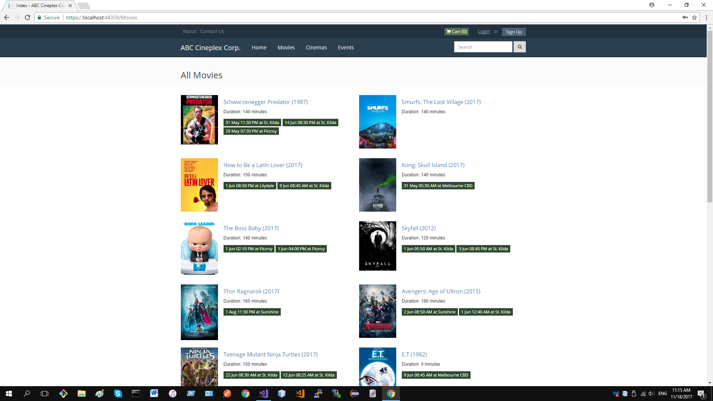
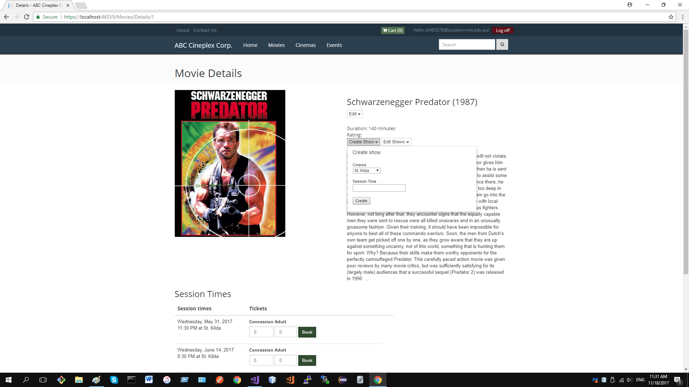
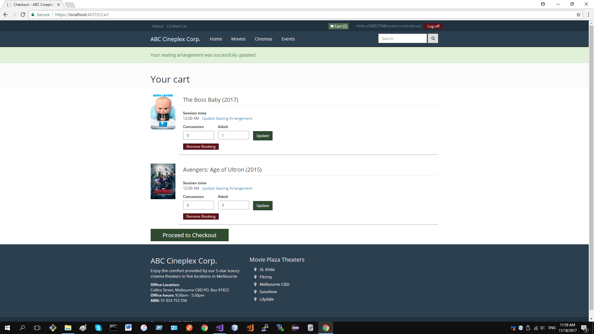
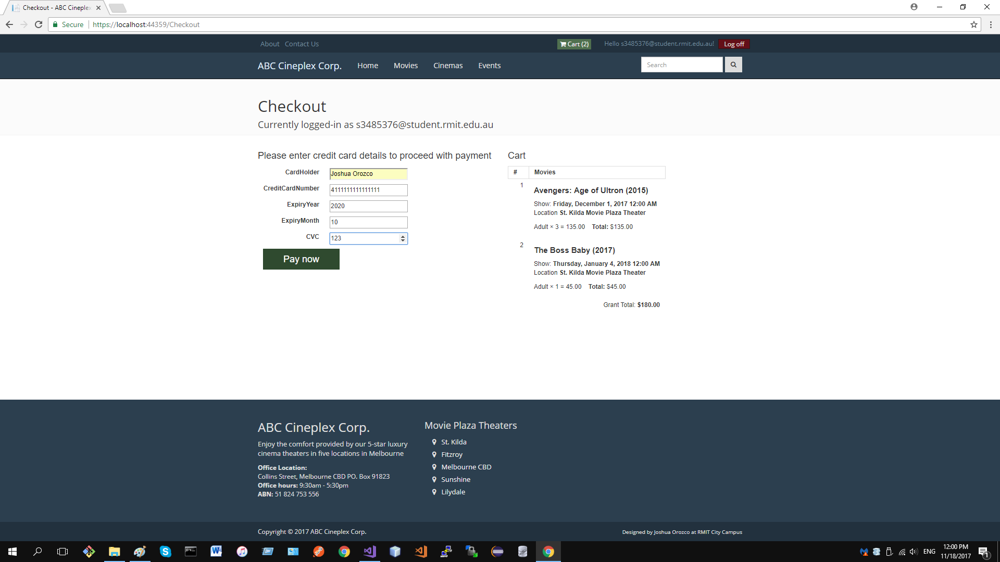
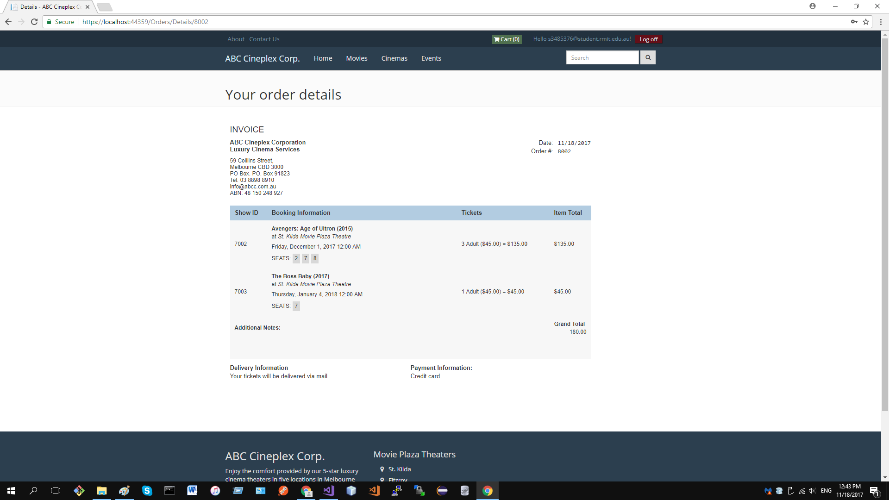

# Cineplex ASP.NET Core project
RMIT Web Development Technologies WDT - Assignment 2. Cineplex Cinema Booking Website 
<i>Note: This project is very challenging!</i>

#### Technical Requirements
- Enterprise-level web application written in ASP.NET Core with SQL Server LocalDB database
- Client and server side validation.
- Professional layout is REQUIRED!
- JS/CSS plugins allowed :)
- At least 1 of these is required - xUnit tests or additional awesome JS plugins (that's lots of JS/CSS plugins)

#### Business Requirements
- 4 main pages - Home, Movies, Cinemas, Events. Provide additional pages, not just these 4 main pages
- Home page with featured carousel (+ additional fancy stuff)
- Movie pages with upcoming movies and movie shows (or aka movie sessions)
- Cinema page with cinema information and movies
- Events Pages related to company events (eg. news, blog post, highlights)
- Cinema booking website to showcase 5 luxury cinemas around Melbourne area
- Cinema places are called "Movie Plaza Theater"s
- Melbourne CBD, St. Kilda, Fitzroy, Sunshine, Lilydale locations.
- Login and Registration with Facebook (or Google)
- 2 types of tickets for customers - Concession $20 and Adults $45 per ticket;
- different movies for different cinemas everyday
- up to 5 avaialble movie sessions per movie per day
- max 5 tickets per purchase
- each cinema contains up to 20 seats only. Customer can pick their seats
- checking out requires login. Login can be via Facebook, Google or in-built login system
- checkout requires credit card validation (mock payments, no real CC transaction)
- successful purchase presents an order summary page. Receipt saved in purchase history. 
- Order summary has link to logout.

#### Additional features added (not part of requirements)
- Admin system to create, movies and cinema info

#### Additional Images

